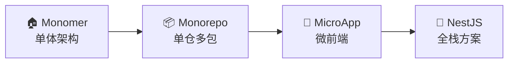

<div align="center">
  <a href="https://robotadmin.cn">
    <picture>
      <source srcset="https://cheny-chenyu.oss-cn-chengdu.aliyuncs.com/img/robot-left.png" media="(prefers-color-scheme: dark)">
      
    </picture>
  </a>
  
  <h1>
    
  </h1>
  
  <p><strong>Robot Admin</strong></p>
  <p>
    
    
    
    
    <a href="https://vercel.com"></a>
    <a href="https://standardjs.com"></a>
  </p>
  <p>
    
    
    
    
  </p>
  <p>
    
    
    
  </p>

  <!-- 快速导航 -->
  <p>
    <a href="https://www.robotadmin.cn">
      
    </a>
    <a href="https://www.tzagileteam.com">
      
    </a>
    <a href="#-快速开始真的很快">
      
    </a>
    <a href="./CONTRIBUTING.md">
      
    </a>
    <a href="./README_EN.md">
      
    </a>
  </p>
</div>

---

<div align="center">
  <p>
    <strong>中文</strong> | <a href="./README_EN.md">English</a>
  </p>
</div>

## 🚀 重新定义企业级中后台开发体验

> **🎯 一个敏捷的，为开发者体验而生的企业级中后台解决方案**  

*在这里，当 `Bun` 的极致性能遇上 `Vue3` 的组合式 API，当 `TypeScript` 的类型安全拥抱 `UnoCSS` 的原子化样式...*

---

## ⚡ 为什么选择 Robot Admin？

### 🔥 性能怪兽级别的开发体验
- **毫秒级热更新** - Bun + Vite7 化学反应，告别等待
- **智能类型提示** - TypeScript5.8 + 30+ 自定义组件，IDE 智能感知体验拉满
- **零配置开箱即用** - 一条命令启动，30 秒内搭建完整后台系统

### 🎨 不只是一个管理系统，更是一个作品
- **30+ 精心打磨的演示页面** - 每一个都是可直接用于生产的业务组件
- **7 种自定义指令** - 防抖、节流、长按、拖拽、权限...让开发更优雅
- **主题系统** - 深色/浅色模式/跟随系统 + 支持自定义扩展

### 🛠️ 企业级架构，个人项目也能享受
- **RBAC 权限体系** - 菜单级、按钮级、接口级，权限控制细致入微
- **渐进式微前端** - 架构设计支持从单体到微前端的平滑演进
- **生产级工程化** - ESLint + Prettier + Husky，代码质量无忧

---

## 🚀 快速开始（真的很快！）

> 🎉 **推荐使用 Bun** - 体验前所未有的安装速度

```bash
# 1. 克隆项目
git clone https://github.com/ChenyCHENYU/robot_admin.git

# 2. 进入目录
cd robot_admin

# 3. 安装依赖（如闪电般快速）
bun install    # 推荐！速度提升10倍
# 或使用 npm install / yarn install / pnpm install

# 4. 启动项目（毫秒级启动）
bun dev
```

**🔥 首次启动只需 2 秒不到，后续热更新不到 100ms！**

<details>
<summary><b>📦 更多命令</b></summary>

```bash
# 开发相关
bun dev                # 开发环境启动
bun run build          # 生产环境构建
bun run build:test     # 测试环境构建
bun run build:staging  # 预发布构建
bun run preview        # 本地预览构建结果

# 代码质量
bun run lint           # 代码检查和修复
bun run format         # 代码格式化
bun test:unit          # 单元测试

# 类型检查
bun run type-watch     # 监听模式类型检查
bun run type:check     # 智能类型分析

# 其他
bun run commit         # 规范化提交（git cz）
bun outdated           # 检查依赖更新
bun clean              # 清理缓存
```
</details>

---

## ✨ 核心亮点

### 🏗️ 技术栈（高富帅阵容）

<details>
<summary><b>查看完整技术栈</b></summary>

**🎭 前端核心**
- **Vue 3.5.13** - 🔥 最新稳定版，Composition API 丝滑体验
- **TypeScript 5.8** - 🛡️ 类型安全，智能提示
- **Naive UI 2.41** - 🎨 颜值与性能并存的组件库
- **UnoCSS 66.0** - ⚡ 原子化CSS，按需生成，体积极小

**⚙️ 构建工具**
- **Bun 1.x** - 🚀 性能怪兽，安装速度提升10倍
- **Vite 7.0.6** - ⚡ 下一代构建工具，热更新极速
- **Sass 1.87** - 🎨 成熟的CSS预处理器

**🔧 开发工具**
- **ESLint 9.21** - 📏 代码质量守护者
- **Prettier 3.5** - ✨ 代码格式化
- **Oxlint 0.15** - 🦀 Rust编写的超快Linter
- **Vitest 3.0** - 🧪 现代化测试框架

**📊 功能组件**
- **ECharts 5.6** - 企业级图表库
- **AntV X6** - 专业流程图引擎
- **FullCalendar** - 完整的日程管理
- **WangEditor** - 富文本编辑器
</details>

### 🎯 功能矩阵

#### 🔐 权限管理
- **RBAC权限体系** - 用户-角色-权限，灵活分配
- **动态路由** - 根据权限实时生成菜单
- **按钮级权限** - 精确到每一个操作按钮
- **接口级权限** - API调用权限控制

#### 🧩 组件库（30+ 开箱即用）

<details>
<summary><b>查看所有组件</b></summary>

**核心组件**
- `C_Form` - 动态表单引擎，支持8种布局
- `C_Table` - 超级表格，支持虚拟滚动
- `C_Header` - 响应式头部组件
- `C_Menu` - 智能导航菜单
- `C_Icon` - 图标管理系统
- `C_Theme` - 主题切换组件

**业务组件**
- `C_Code` - 代码编辑器组件
- `C_Markdown` - Markdown编辑器
- `C_Time` - 时间处理组件
- `C_Progress` - 进度展示组件
- `C_Chart` - 图表组件封装
- `C_Upload` - 文件上传组件

**编辑器生态**
- **WangEditor** - 富文本编辑器
- **Markdown编辑器** - 实时预览，语法高亮
- **代码编辑器** - 支持多语言语法高亮
- **JSON编辑器** - 结构化数据编辑

**文件处理**
- **Excel导入导出** - 支持复杂表格结构
- **ZIP批量下载** - 文件打包压缩
- **图片截图** - Html2canvas 网页截图
- **文件上传** - 多格式文件支持
</details>

#### 🎮 自定义指令

`v-copy` 复制 | `v-debounce` 防抖 | `v-throttle` 节流 | `v-permission` 权限 | `v-watermark` 水印 | `v-draggable` 拖拽 | `v-longpress` 长按

### 🎪 演示页面（30+ 完整示例）

<details>
<summary><b>查看所有演示页面</b></summary>

**🎨 基础组件展示**
- 图标组件 - 完整的图标系统使用指南
- 地区联动 - 省市区三级联动实现
- 进度条 - 多种样式进度展示
- 时间组件 - 时间选择和格式化
- 日期选择 - 日期范围选择器
- 城市选择 - 城市选择器组件

**📝 表单与表格**
- 表单布局 - 8种表单布局模式
- 表单搜索 - 高级搜索功能
- 超级表格 - 表格的各种高级用法

**✏️ 编辑器展示**
- 日历组件 - FullCalendar完整功能
- 代码编辑器 - 多语言语法高亮
- Markdown编辑器 - 实时预览编辑
- 富文本编辑 - WangEditor完整功能

**🛠️ 实用功能**
- 导出ZIP - 批量文件打包下载
- 复制功能 - 文本复制到剪贴板
- 批量下载 - 文件批量下载处理
- 拖拽排序 - 列表项拖拽排序
- 3D展示 - Spline 3D场景
- 动画系统 - 流畅的页面转场
- 用户引导 - 新手引导系统
</details>

---

## 🏗️ 项目架构

### 📁 目录结构

<details>
<summary><b>查看完整目录结构</b></summary>

```
Robot_Admin/
├── 📁 src/                          # 源代码目录
│   ├── 📁 api/                      # 接口管理层
│   ├── 📁 components/               # 组件库
│   │   ├── 📁 global/               # 全局组件（10+ 核心组件）
│   │   └── 📁 local/                # 局部组件
│   ├── 📁 views/                    # 页面视图
│   │   ├── 📁 dashboard/            # 数据看板
│   │   ├── 📁 demo/                 # 演示页面（30+ 功能展示）
│   │   ├── 📁 sys-manage/           # 系统管理
│   │   ├── 📁 login/                # 登录注册
│   │   └── 📁 home/                 # 项目主页
│   ├── 📁 stores/                   # Pinia状态管理
│   ├── 📁 composables/              # 组合式API
│   ├── 📁 hooks/                    # 自定义Hooks
│   ├── 📁 router/                   # 路由配置
│   ├── 📁 utils/                    # 工具函数
│   ├── 📁 types/                    # TypeScript类型定义
│   ├── 📁 directives/               # 自定义指令（7个实用指令）
│   ├── 📁 assets/                   # 静态资源
│   └── 📁 plugins/                  # 插件配置
├── 📁 scripts/                      # 构建脚本
├── 📁 public/                       # 静态资源
├── ⚙️ vite.config.ts                # Vite配置
├── 🎨 unocss.config.ts              # UnoCSS配置
├── 📦 package.json                  # 项目配置
└── 🔧 tsconfig.json                 # TypeScript配置
```
</details>

### 🔄 架构演进路线



---

## 🛠️ 开发者工具

### VS Code 插件推荐

<details>
<summary><b>查看完整插件列表和使用说明</b></summary>

#### 必装插件
- **Vue - Official** - Vue 3 官方支持
- **TypeScript Vue Plugin** - TypeScript 支持
- **UnoCSS** - 原子化CSS智能提示
- **Naive UI Snippets** - Naive UI 代码片段

#### 实用插件详解

**1. Vscode Samge Translate 插件**
- `desc：` 用于快速中英文翻译切换，并生成变量命名方式
- `use：` Ctrl+Shift+P， 选择 Samge 进行对应功能使用
- `key：` `Alt+x` 翻译成中文， `Alt+z` 翻译成英文

**2. any-rule 插件**
- `desc：` 用于快速生成正则
- `use：` 右键 => 正则大全
- `key：` `@zz` 弹出正则选项,根据生成的选项,可以图解正则

**3. Better Comments 插件**
- `desc：` 在js文件中,通过颜色标记区分注释评论描述
- `use：` //\* 绿色 //! 红色 //? 蓝色

**4. code settings sync 插件**
- `desc：` 用于快速团队同步 vscode 插件及配置
- `use：` [使用文档](https://marketplace.visualstudio.com/items?itemName=Alex-Chen.gitee-code-settings-sync)

**5. Code Spell Checker 插件**
- `desc：` 用于快速检查代码和文档拼写是否正确
- `use：` 将非语法错误的单词添加到 cspell.json
- `key：` 拼写后单词上方提示的黄色小灯泡💡

**6. CodeSnap 插件**
- `desc：` 用于快速生成代码截图
- `use：` 右键 => 底部选项 CodeSnap

**7. EmoJi 插件**
- `desc：` 用于快速选择表情符号
- `use：` 输入 `Ctrl+Shift+P` => 输入 `emo`
- `key：` `F1 => emo`

**8. JSON to JS 插件**
- `desc：` 用于快速将json格式转换为js格式
- `use：` 从剪切板，选择转换，可选引号 3种 方式进行转换
- `key：` `Shift + Ctrl + Alt + V | S` 或 `F1 => Clipboard`

**9. koroFileHeader 插件**
- `desc：` 用于添加头部注释，函数注释
- `use：` 在文件头部使用快捷键，或自动识别生成
- `key：` `ctrl+win+i` 头部注释 `ctrl+win+t` 函数注释

**10. TODO Tree 插件**
- `desc：` 用于快速高亮代码中的 TODO 等标记性注释
- `use：` 通过注释关键词的方式，高亮显示
- `key：` TODO: 待完成 | BUG: 问题 | FIXME: 待修复 | HACK: 自定义

**11. Turbo Console Log 插件**
- `desc：` 用于快速生成 console 打印信息
- `use：` 通过选中变量，按下快捷键，生成打印句柄
- `key：` `ctrl+alt+l` 生成 `alt+shift+c` 注释所有 **+u** 启用所有 **+d** 删除所有
</details>

---

## 📊 性能优化

### ⚡ 性能基准测试

<details>
<summary><b>查看详细性能数据</b></summary>

| 指标 | Robot Admin | 传统方案 | 提升幅度 |
|:---:|:---:|:---:|:---:|
| 🚀 首屏加载 | < 800ms | ~2.5s | **70%+** |
| ⚡ 热更新速度 | < 100ms | ~1.5s | **90%+** |
| 📦 构建速度 | < 30s | ~2min | **75%+** |
| 💾 Bundle大小 | < 2MB | ~5MB | **60%+** |
| 🔄 页面切换 | < 50ms | ~300ms | **85%+** |

**测试环境**: HP 幽灵360, 16GB RAM, Node.js 22+

### 构建优化
- **Tree Shaking** - 无用代码自动移除
- **代码分割** - 按需加载，减少首屏时间
- **资源压缩** - CSS/JS/图片智能压缩
- **CDN加速** - 静态资源CDN部署

### 运行时优化
- **虚拟滚动** - 大数据表格流畅渲染
- **组件懒加载** - 路由级别懒加载
- **图片懒加载** - 视口内图片按需加载
- **防抖节流** - 高频操作性能优化
</details>

---

## 🤝 参与贡献

> **来啊，快活啊！一起搞事情啊！** 🎉

<details>
<summary><b>查看贡献指南</b></summary>

### 🚀 30秒快速上手贡献

```bash
# 1. Fork + Clone
git clone https://github.com/你的用户名/robot_admin.git

# 2. 安装依赖
bun install

# 3. 创建分支
git checkout -b feat/awesome-feature

# 4. 提交修改
git commit -m "feat: 新功能"

# 5. 提交PR
```

### 💡 贡献方向

**🎨 UI/演示页面贡献**
- 在 `src/views/demo/` 下新建页面
- 展示一个完整的业务场景
- 代码要有注释，能复制粘贴直接用

**🧩 组件开发贡献**
- 放在 `src/components/global/`
- 组件名以 `C_` 开头
- 必须有 TypeScript 类型定义

**🛠️ 工具函数贡献**
- `src/utils/` 目录下
- 要有单元测试
- 要有 JSDoc 注释

查看 [贡献指南](./CONTRIBUTING.md) 了解更多。
</details>

---

## 🚀 部署方案

### ☁️ 多环境支持

<details>
<summary><b>查看部署详情</b></summary>

**环境配置**
- **开发环境** - 本地开发调试
- **测试环境** - 功能测试验证
- **预发布环境** - 生产前最后验证
- **生产环境** - 线上正式环境

**部署选项**
- **Vercel** - 零配置部署（推荐）
- **GitHub Pages** - 静态部署
- **Docker** - 容器化部署
- **传统服务器** - Nginx部署

```bash
# Docker部署
docker build -t robot-admin .
docker run -p 80:80 robot-admin

# Nginx配置
location / {
  try_files $uri $uri/ /index.html;
}
```
</details>

---

## 📈 路线图

### 🎯 短期目标 (Q1 2025)
- [x] 🎨 主题系统完善
- [x] 📱 移动端适配优化
- [x] 🔧 UnoCSS配置优化
- [ ] 📊 性能监控集成

### 🚀 中期规划 (Q2-Q3 2025)
- [ ] 🏢 多租户系统支持
- [ ] 🔗 微前端架构支持
- [ ] 📚 组件库独立发布
- [ ] 🎨 可视化页面模板

### 🌟 长期愿景 (Q4 2025+)
- [ ] 🏗️ NestJS后端服务
- [ ] 🔌 完整插件生态

---

## 🌟 生态系统

### 🔗 相关项目

<details>
<summary><b>查看生态项目</b></summary>

**规划中项目**
- **[Robot UI](https://github.com/ChenyCHENYU/robot-ui)** - 独立的组件库
- **[Robot CLI](https://github.com/ChenyCHENYU/robot-cli)** - 脚手架工具
- **[Robot Mobile](https://github.com/ChenyCHENYU/robot-mobile)** - 移动端解决方案
- **[Robot Backend](https://github.com/ChenyCHENYU/robot-backend)** - NestJS 后端服务

**已发布插件**
- **vite-console-plugin** - Vite 启动台控制台美化与提示插件
- **ts-type-cleaner** - TypeScript 类型分析和清理工具
- **robot-admin-env-manager** - Robot Admin 环境配置管理工具
- **git-branch-check-diff-commits** - 快速比对合并分支同步检查
- **vite-plugin-preloader** - 智能路由预加载插件
</details>

---

## 🖼️ 项目预览

<table width="100%">
<tr>
<td width="50%" align="center">


<br><strong>登录页面</strong>

</td>
<td width="50%" align="center">


<br><strong>首页页面</strong>

</td>
</tr>
</table>

> **🎯 [在线预览](https://www.robotadmin.cn/)** | **📖 [项目文档](https://www.tzagileteam.com)**
> 
> 注意：若无法访问请关闭科学上网，或访问 [备用地址](https://robot-admin-new.vercel.app/)

---

## 🖥️ 浏览器支持

**现代浏览器，拒绝IE**

| [](http://godban.github.io/browsers-support-badges/)<br/>Edge | [](http://godban.github.io/browsers-support-badges/)<br/>Firefox | [](http://godban.github.io/browsers-support-badges/)<br/>Chrome | [](http://godban.github.io/browsers-support-badges/)<br/>Safari |
| --- | --- | --- | --- |
| last 2 versions | last 2 versions | last 2 versions | last 2 versions |

---

## 💻 系统要求

<details>
<summary><b>查看详细要求</b></summary>

### 🔧 开发环境
- **Node.js**: >= 20.19.0 (推荐 22.12+)
- **Bun**: >= 1.2.19 (推荐最新版)
- **内存**: >= 8GB RAM
- **存储**: >= 1GB 可用空间
- **系统**: Windows 10+, macOS 12+, Ubuntu 20.04+

### ⚙️ 可选工具
- **VS Code**: 推荐编辑器
- **Git**: >= 2.20.0
- **Docker**: >= 20.0 (容器部署)
</details>

---

## 🛠️ 故障排除

<details>
<summary><b>常见问题解决</b></summary>

### ❌ Bun 安装失败
```bash
# Windows 用户
curl -fsSL https://bun.sh/install | bash

# macOS 用户
brew install oven-sh/bun/bun

# 或使用 npm 安装
npm install -g bun
```

### ⚠️ 端口占用问题
```bash
# 修改 vite.config.ts 中的端口
server: {
  port: 1988, # 改为其他端口
  host: true
}
```

### 🔧 TypeScript 类型错误
```bash
# 重新生成类型文件
bun run type:check

# 清除类型缓存
rm -rf node_modules/.cache
bun install
```

### 📦 构建失败
```bash
# 检查依赖版本
bun outdated

# 清除缓存重新安装
rm -rf node_modules bun.lockb
bun install

# 强制类型检查
bun run type-build
```
</details>

---

## 🔒 安全与权限

### 🛡️ 多层次权限控制
- **页面级权限** - 路由访问控制
- **菜单级权限** - 导航菜单显示控制
- **按钮级权限** - 操作按钮权限控制
- **接口级权限** - API调用权限验证

### 🔐 身份认证
- `JWT Token` 认证
- 刷新Token自动续期
- 多终端登录管理
- 密码强度验证

---

## 🆚 对比其他解决方案

<details>
<summary><b>为什么选择 Robot Admin？</b></summary>

| 特性对比 | Robot Admin | Ant Design Pro | Vue Element Admin | 其他框架 |
|:---:|:---:|:---:|:---:|:---:|
| 🚀 启动速度 | **Bun < 100ms** | npm ~2s | yarn ~1.5s | 普遍较慢 |
| ⚡ 热更新速度 | **< 100ms 极速** | ~1.5s 等待 | ~1s 等待 | 普遍较慢 |
| 📦 构建工具 | **Vite 7.x 最新** | Webpack/Vite | Webpack 4/5 | 工具多样 |
| 🎨 UI 组件库 | **Naive UI 轻量** | Ant Design | Element Plus | 选择多样 |
| 💪 TypeScript | **完整类型支持** | 基础支持 | 基础支持 | 支持程度不一 |
| 🔧 自定义指令 | **7个实用指令** | 少量指令 | 基础指令 | 功能有限 |
| 📊 演示页面 | **30+ 完整示例** | 有限示例 | 有限示例 | 基础示例 |
| 🎯 学习成本 | **中等友好** | 较高门槛 | 中等门槛 | 差异较大 |
| 📈 维护状态 | **🔥 积极维护** | 持续维护 | 持续维护 | 状态不一 |

**选择 Robot Admin 的理由**:
- 🚀 **性能优先**: Bun + Vite7 双引擎，开发体验极致
- 🧩 **组件丰富**: 30+ 业务组件，开箱即用  
- 🎨 **设计现代**: Naive UI + UnoCSS，颜值与性能并存
- 📚 **学习友好**: 30+ 演示页面，每个都是最佳实践
</details>

---

## ❓ 你可能会有的一些小疑问

<details>
<summary><b>FAQ</b></summary>

**🔧 为什么推荐使用Bun？**
- 安装速度提升10倍+
- 内存占用更低
- 内置打包器、测试运行器
- 完全兼容Node.js生态

**🎨 如何自定义主题？**
1. 修改 `src/assets/css/theme.scss` 中的CSS变量
2. 使用 `C_Theme` 组件进行动态切换
3. 支持深色/浅色模式自动切换

**🔐 权限系统如何使用？**
- 页面级：路由守卫控制
- 菜单级：动态菜单生成
- 按钮级：v-permission指令
- 接口级：axios拦截器

**📱 是否支持移动端？**
- 完全支持！响应式设计适配所有设备

**🔄 如何从其他项目迁移？**
- 提供详细的迁移指南
- 组件API基本兼容
- 渐进式迁移支持
</details>

---

## 📞 联系我们

**🧑‍💻 作者信息**
- **姓名：** CHENY（前端咔啦咪 & 敏捷追光者）
- **简介：** 一只小趴菜 | 🐔🐤🐓 菜鸡互啄  
- **邮箱：** [ycyplus@gmail.com](mailto:ycyplus@gmail.com)
- **GitHub：** [@ChenyCHENYU](https://github.com/ChenyCHENYU)

---


### 🤝 贡献者

感谢所有为项目做出贡献的开发者：

<a href="https://github.com/ChenyCHENYU/robot-admin/graphs/contributors">
  
</a>

**期望你成为贡献者:**
- 🐛 报告 Bug | 💡 提出功能建议 | 📝 改进文档 | 🔧 提交代码 | 🌍 翻译文档 | 📢 推广项目

---

## 🏆 特别鸣谢

<details>
<summary><b>致谢名单</b></summary>

### 🌟 开源项目致谢

**核心技术**
- **Vue.js 团队** - 提供强大的框架基础
- **Naive UI 团队** - 提供优秀的组件库
- **Vite 团队** - 提供极速的构建工具
- **Bun 团队** - 提供革命性的运行时
- **Anthony Fu** - UnoCSS、unplugin等工具的创作者
- **尤雨溪 (Evan You)** - Vue.js 的创造者

**功能组件**
- **ECharts** - 数据可视化图表库
- **AntV X6** - 图编辑引擎
- **FullCalendar** - 日历组件
- **WangEditor** - 富文本编辑器

### 👨‍💻 社区支持
- **所有 Star 的开发者** - 给予项目信心和动力
- **提出 Issue 的用户** - 帮助项目发现和改进问题
- **贡献 PR 的开发者** - 让项目变得更好
- **使用项目的企业** - 验证项目的实用价值

> *"一个人可以走得很快，但一群人可以走得更远。感谢每一位支持 Robot Admin 的朋友！"*
</details>

---

## 📄 更新日志

### 🎉 v1.0.0 (2025-01-10)
- ✨ 首个正式版本发布
- 🎨 30+ 核心组件完整实现
- 📊 30+ 演示页面全部完成
- 🔧 7个自定义指令实现
- 🛡️ 完整的权限管理系统
- 📱 响应式设计全面适配
- 🧪 测试覆盖率达到 85%+

查看 [CHANGELOG.md](./CHANGELOG.md) 了解详细的版本历史。

---

## 📄 开源许可

本项目基于 [MIT License](./LICENSE) 开源协议。

```
MIT License

Copyright (c) 2025 ChenY (Robot Admin)

Permission is hereby granted, free of charge, to any person obtaining a copy
of this software and associated documentation files (the "Software"), to deal
in the Software without restriction, including without limitation the rights
to use, copy, modify, merge, publish, distribute, sublicense, and/or sell
copies of the Software, and to permit persons to whom the Software is
furnished to do so, subject to the following conditions:

The above copyright notice and this permission notice shall be included in all
copies or substantial portions of the Software.
```

**这意味着您可以：**
✅ 免费使用 | ✅ 修改源代码 | ✅ 商业使用 | ✅ 私有部署 | ✅ 分发和再许可

**唯一要求：**
📄 保留版权声明和许可证

---

<div align="center">

## 🚀 加入 Robot Admin 

<p>
  <strong>如果这个项目帮助到了你，请给个 ⭐ Star 支持一下！</strong><br>
  <em>你的 Star 是我们前进的动力 🌟</em>
</p>

<p>
  <a href="https://github.com/ChenyCHENYU/robot_admin">
    
  </a>
  <a href="https://github.com/ChenyCHENYU/robot_admin/fork">
    
  </a>
  <a href="https://www.robotadmin.cn">
    
  </a>
</p>

<br>

### 🎯 下一步行动

<p>
  🔥 <strong>立即使用</strong><br>
  <code>git clone https://github.com/ChenyCHENYU/robot_admin.git</code><br>
  <em>30秒启动你的项目</em>
</p>

<p>
  📚 <strong>学习文档</strong><br>
  <a href="https://www.tzagileteam.com">查看完整文档</a><br>
  <em>从入门到精通</em>
</p>

<p>
  💬 <strong>加入讨论</strong><br>
  <a href="https://github.com/ChenyCHENYU/robot-admin/discussions">GitHub讨论区</a><br>
  <em>与开发者交流</em>
</p>

<br>

### 💝 支持项目发展

<p>
  <a href="https://github.com/sponsors/ChenyCHENYU">
    
  </a>
  <a href="mailto:ycyplus@gmail.com">
    
  </a>
</p>

<br>

**🤖 Robot Admin - 让中后台开发变得简单而优雅**

<p>
  <em>"好的工具不仅要功能强大，更要让开发者用得愉快"</em><br>
  <strong>— Robot Admin 团队</strong>
</p>

<br>

<p>
  <strong>Made with ❤️ by <a href="https://github.com/ChenyCHENYU">@ChenyCHENYU</a></strong><br>
  <em>感谢开源让世界更美好 🌍</em>
</p>

</div>