<div align="center">
  <a href="https://robotadmin.cn">
    <picture>
      <source srcset="https://cheny-chenyu.oss-cn-chengdu.aliyuncs.com/img/robot-left.png" media="(prefers-color-scheme: dark)">
      
    </picture>
  </a>
  
  <h1>
    
  </h1>
  
  <p><strong>Robot Admin</strong></p>
  <p>
    <a href="https://github.com/ChenyCHENYU/robot_admin/actions"></a>
    <a href="https://standardjs.com"></a>
    
    
    
    
  </p>
  <p>
    
    
    
    
  </p>
  <p>
    
    
    
  </p>

  <!-- Quick Navigation -->
  <p>
    <a href="https://www.robotadmin.cn">
      
    </a>
    <a href="https://www.tzagileteam.com">
      
    </a>
    <a href="#-quick-start-lightning-fast">
      
    </a>
    <a href="./CONTRIBUTING.md">
      
    </a>
    <a href="./README.md">
      
    </a>
  </p>
</div>

---

<div align="center">
  <p>
    <strong>English</strong> | <a href="./README.md">中文</a>
  </p>
</div>

## 🚀 Redefining Enterprise Admin Development Experience

> **🎯 An agile, developer-experience-first enterprise admin solution**  

*Here, when `Bun's` ultimate performance meets `Vue3's` Composition API, when `TypeScript's` type safety embraces `UnoCSS's` atomic styling...*

---

## ⚡ Why Choose Robot Admin?

### 🔥 Monster-Level Performance Development Experience
- **Millisecond Hot Updates** - Bun + Vite7 chemical reaction, say goodbye to waiting
- **Intelligent Type Hints** - TypeScript5.8 + 30+ custom components, IDE intelligence maxed out
- **Zero Config Out-of-Box** - One command to start, complete admin system in 30 seconds

### 🎨 Not Just a Management System, But a Masterpiece
- **30+ Carefully Crafted Demo Pages** - Each one is production-ready business component
- **7 Custom Directives** - Debounce, throttle, long press, drag, permission... Make development elegant
- **Theme System** - Dark/Light mode/Follow system + Custom extension support

### 🛠️ Enterprise Architecture, Personal Projects Can Also Enjoy
- **RBAC Permission System** - Menu-level, button-level, API-level, fine-grained permission control
- **Progressive Micro-frontend** - Architecture design supports smooth evolution from monolith to micro-frontend
- **Production-Grade Engineering** - ESLint + Prettier + Husky, code quality assured

---

## 🚀 Quick Start (Lightning Fast!)

> 🎉 **Recommended using Bun** - Experience unprecedented installation speed

```bash
# 1. Clone project
git clone https://github.com/ChenyCHENYU/robot_admin.git

# 2. Enter directory
cd robot_admin

# 3. Install dependencies (lightning fast)
bun install    # Recommended! 10x speed boost
# or use npm install / yarn install / pnpm install

# 4. Start project (millisecond startup)
bun dev
```

**🔥 First startup takes less than 2 seconds, subsequent hot updates under 100ms!**

<details>
<summary><b>📦 More Commands</b></summary>

```bash
# Development
bun dev                # Start development environment
bun run build          # Production build
bun run build:test     # Test environment build
bun run build:staging  # Staging build
bun run preview        # Preview build locally

# Code Quality
bun run lint           # Code check and fix
bun run format         # Code formatting
bun test:unit          # Unit testing

# Type Checking
bun run type-watch     # Watch mode type checking
bun run type:check     # Smart type analysis

# Others
bun run commit         # Standardized commit (git cz)
bun outdated           # Check dependency updates
bun clean              # Clean cache
```
</details>

---

## ✨ Core Highlights

### 🏗️ Tech Stack (Premium Arsenal)

<details>
<summary><b>View Complete Tech Stack</b></summary>

**🎭 Frontend Core**
- **Vue 3.5.13** - 🔥 Latest stable version, silky Composition API experience
- **TypeScript 5.8** - 🛡️ Type safety, intelligent hints
- **Naive UI 2.41** - 🎨 Component library with both beauty and performance
- **UnoCSS 66.0** - ⚡ Atomic CSS, on-demand generation, minimal size

**⚙️ Build Tools**
- **Bun 1.x** - 🚀 Performance monster, 10x installation speed
- **Vite 7.0.6** - ⚡ Next-generation build tool, lightning hot updates
- **Sass 1.87** - 🎨 Mature CSS preprocessor

**🔧 Development Tools**
- **ESLint 9.21** - 📏 Code quality guardian
- **Prettier 3.5** - ✨ Code formatting
- **Oxlint 0.15** - 🦀 Ultra-fast Linter written in Rust
- **Vitest 3.0** - 🧪 Modern testing framework

**📊 Functional Components**
- **ECharts 5.6** - Enterprise-grade chart library
- **AntV X6** - Professional flowchart engine
- **FullCalendar** - Complete calendar management
- **WangEditor** - Rich text editor
</details>

### 🎯 Feature Matrix

#### 🔐 Permission Management
- **RBAC Permission System** - User-Role-Permission, flexible assignment
- **Dynamic Routing** - Real-time menu generation based on permissions
- **Button-Level Permissions** - Precise control down to every action button
- **API-Level Permissions** - API call permission control

#### 🧩 Component Library (30+ Ready-to-Use)

<details>
<summary><b>View All Components</b></summary>

**Core Components**
- `C_Form` - Dynamic form engine, supports 8 layouts
- `C_Table` - Super table with virtual scrolling support
- `C_Header` - Responsive header component
- `C_Menu` - Smart navigation menu
- `C_Icon` - Icon management system
- `C_Theme` - Theme switching component

**Business Components**
- `C_Code` - Code editor component
- `C_Markdown` - Markdown editor
- `C_Time` - Time processing component
- `C_Progress` - Progress display component
- `C_Chart` - Chart component wrapper
- `C_Upload` - File upload component

**Editor Ecosystem**
- **WangEditor** - Rich text editor
- **Markdown Editor** - Real-time preview, syntax highlighting
- **Code Editor** - Multi-language syntax highlighting support
- **JSON Editor** - Structured data editing

**File Processing**
- **Excel Import/Export** - Support for complex table structures
- **ZIP Batch Download** - File packaging compression
- **Image Screenshot** - Html2canvas web screenshot
- **File Upload** - Multi-format file support
</details>

#### 🎮 Custom Directives

`v-copy` Copy | `v-debounce` Debounce | `v-throttle` Throttle | `v-permission` Permission | `v-watermark` Watermark | `v-draggable` Draggable | `v-longpress` Long Press

### 🎪 Demo Pages (30+ Complete Examples)

<details>
<summary><b>View All Demo Pages</b></summary>

**🎨 Basic Component Showcase**
- Icon Component - Complete icon system usage guide
- Region Linkage - Province-City-District three-level linkage
- Progress Bar - Multiple style progress displays
- Time Component - Time selection and formatting
- Date Picker - Date range picker
- City Selector - City selector component

**📝 Forms & Tables**
- Form Layout - 8 form layout modes
- Form Search - Advanced search functionality
- Super Table - Various advanced table usages

**✏️ Editor Showcase**
- Calendar Component - FullCalendar complete functionality
- Code Editor - Multi-language syntax highlighting
- Markdown Editor - Real-time preview editing
- Rich Text Editor - WangEditor complete functionality

**🛠️ Practical Functions**
- Export ZIP - Batch file packaging download
- Copy Function - Text copy to clipboard
- Batch Download - Batch file download processing
- Drag & Drop Sort - List item drag sorting
- 3D Display - Spline 3D scenes
- Animation System - Smooth page transitions
- User Guide - Onboarding guide system
</details>

---

## 🏗️ Project Architecture

### 📁 Directory Structure

<details>
<summary><b>View Complete Directory Structure</b></summary>

```
Robot_Admin/
├── 📁 src/                          # Source code directory
│   ├── 📁 api/                      # API management layer
│   ├── 📁 components/               # Component library
│   │   ├── 📁 global/               # Global components (10+ core components)
│   │   └── 📁 local/                # Local components
│   ├── 📁 views/                    # Page views
│   │   ├── 📁 dashboard/            # Data dashboard
│   │   ├── 📁 demo/                 # Demo pages (30+ feature showcases)
│   │   ├── 📁 sys-manage/           # System management
│   │   ├── 📁 login/                # Login/Register
│   │   └── 📁 home/                 # Project homepage
│   ├── 📁 stores/                   # Pinia state management
│   ├── 📁 composables/              # Composable APIs
│   ├── 📁 hooks/                    # Custom hooks
│   ├── 📁 router/                   # Router configuration
│   ├── 📁 utils/                    # Utility functions
│   ├── 📁 types/                    # TypeScript type definitions
│   ├── 📁 directives/               # Custom directives (7 practical directives)
│   ├── 📁 assets/                   # Static assets
│   └── 📁 plugins/                  # Plugin configurations
├── 📁 scripts/                      # Build scripts
├── 📁 public/                       # Static resources
├── ⚙️ vite.config.ts                # Vite configuration
├── 🎨 unocss.config.ts              # UnoCSS configuration
├── 📦 package.json                  # Project configuration
└── 🔧 tsconfig.json                 # TypeScript configuration
```
</details>

### 🔄 Architecture Evolution Roadmap

```mermaid
graph LR
    A[🏠 Monomer<br/>Monolithic] --> B[📦 Monorepo<br/>Multi-package]
    B --> C[🔗 MicroApp<br/>Micro-frontend]
    C --> D[🚀 NestJS<br/>Full-stack]
```



---

## 🛠️ Developer Tools

### VS Code Extensions Recommended

<details>
<summary><b>View Complete Extension List and Usage</b></summary>

#### Essential Extensions
- **Vue - Official** - Vue 3 official support
- **TypeScript Vue Plugin** - TypeScript support
- **UnoCSS** - Atomic CSS intelligent hints
- **Naive UI Snippets** - Naive UI code snippets

#### Detailed Practical Extensions

**1. Vscode Samge Translate Extension**
- `desc:` For quick Chinese-English translation switching and variable naming generation
- `use:` Ctrl+Shift+P, select Samge for corresponding functionality
- `key:` `Alt+x` translate to Chinese, `Alt+z` translate to English

**2. any-rule Extension**
- `desc:` For quick regex generation
- `use:` Right-click => Regex Collection
- `key:` `@zz` popup regex options, can visualize regex based on generated options

**3. Better Comments Extension**
- `desc:` Color-code different comment types in JS files
- `use:` //\* green //! red //? blue

**4. code settings sync Extension**
- `desc:` For quick team synchronization of vscode extensions and configurations
- `use:` [Documentation](https://marketplace.visualstudio.com/items?itemName=Alex-Chen.gitee-code-settings-sync)

**5. Code Spell Checker Extension**
- `desc:` For quick checking of code and document spelling correctness
- `use:` Add non-grammar error words to cspell.json
- `key:` Yellow light bulb💡 above misspelled words

**6. CodeSnap Extension**
- `desc:` For quick code screenshot generation
- `use:` Right-click => Bottom option CodeSnap

**7. EmoJi Extension**
- `desc:` For quick emoji selection
- `use:` Input `Ctrl+Shift+P` => input `emo`
- `key:` `F1 => emo`

**8. JSON to JS Extension**
- `desc:` For quick JSON to JS format conversion
- `use:` From clipboard, select conversion, choose from 3 quote types
- `key:` `Shift + Ctrl + Alt + V | S` or `F1 => Clipboard`

**9. koroFileHeader Extension**
- `desc:` For adding header comments and function comments
- `use:` Use shortcuts in file headers or auto-generate, function comments with shortcuts
- `key:` `ctrl+win+i` header comment `ctrl+win+t` function comment

**10. TODO Tree Extension**
- `desc:` For quick highlighting of TODO and other marker comments in code
- `use:` Highlight display through comment keywords
- `key:` TODO: Pending | BUG: Issue | FIXME: Fix needed | HACK: Custom

**11. Turbo Console Log Extension**
- `desc:` For quick console print statement generation
- `use:` Select variable, press shortcut to generate print statement
- `key:` `ctrl+alt+l` generate `alt+shift+c` comment all **+u** enable all **+d** delete all
</details>

---

## 📊 Performance Optimization

### ⚡ Performance Benchmark

<details>
<summary><b>View Detailed Performance Data</b></summary>

| Metric | Robot Admin | Traditional | Improvement |
|:---:|:---:|:---:|:---:|
| 🚀 First Load | < 800ms | ~2.5s | **70%+** |
| ⚡ Hot Reload | < 100ms | ~1.5s | **90%+** |
| 📦 Build Speed | < 30s | ~2min | **75%+** |
| 💾 Bundle Size | < 2MB | ~5MB | **60%+** |
| 🔄 Page Switch | < 50ms | ~300ms | **85%+** |

**Test Environment**: HP Specter 360, 16GB RAM, Node.js 22+

### Build Optimizations
- **Tree Shaking** - Automatic dead code elimination
- **Code Splitting** - On-demand loading, reduced initial load time
- **Asset Compression** - Smart CSS/JS/image compression
- **CDN Acceleration** - Static asset CDN deployment

### Runtime Optimizations
- **Virtual Scrolling** - Smooth rendering of large data tables
- **Component Lazy Loading** - Route-level lazy loading
- **Image Lazy Loading** - Viewport-based image loading
- **Debounce & Throttle** - High-frequency operation performance optimization
</details>

---

## 🤝 Contributing

> **Come on, let's have fun! Let's build something together!** 🎉

<details>
<summary><b>View Contributing Guide</b></summary>

### 🚀 30-Second Quick Contribution

```bash
# 1. Fork + Clone
git clone https://github.com/yourusername/robot_admin.git

# 2. Install dependencies
bun install

# 3. Create branch
git checkout -b feat/awesome-feature

# 4. Commit changes
git commit -m "feat: new feature"

# 5. Submit PR
```

### 💡 Contribution Directions

**🎨 UI/Demo Page Contributions**
- Create new pages under `src/views/demo/`
- Showcase complete business scenarios
- Code should be commented and copy-paste ready

**🧩 Component Development Contributions**
- Place in `src/components/global/`
- Component names start with `C_`
- Must have TypeScript type definitions

**🛠️ Utility Function Contributions**
- Under `src/utils/` directory
- Should have unit tests
- Should have JSDoc comments

See [Contributing Guide](./CONTRIBUTING.md) for more details.
</details>

---

## 🚀 Deployment Solutions

### ☁️ Multi-Environment Support

<details>
<summary><b>View Deployment Details</b></summary>

**Environment Configuration**
- **Development** - Local development debugging
- **Testing** - Feature testing validation
- **Staging** - Pre-production validation
- **Production** - Live production environment

**Deployment Options**
- **Vercel** - Zero-config deployment (Recommended)
- **GitHub Pages** - Static deployment
- **Docker** - Containerized deployment
- **Traditional Server** - Nginx deployment

```bash
# Docker deployment
docker build -t robot-admin .
docker run -p 80:80 robot-admin

# Nginx configuration
location / {
  try_files $uri $uri/ /index.html;
}
```
</details>

---

## 📈 Roadmap

### 🎯 Short-term Goals (Q1 2025)
- [x] 🎨 Theme system improvement
- [x] 📱 Mobile adaptation optimization
- [x] 🔧 UnoCSS configuration optimization
- [ ] 📊 Performance monitoring integration

### 🚀 Medium-term Planning (Q2-Q3 2025)
- [ ] 🏢 Multi-tenant system support
- [ ] 🔗 Micro-frontend architecture support
- [ ] 📚 Independent component library release
- [ ] 🎨 Visual page templates

### 🌟 Long-term Vision (Q4 2025+)
- [ ] 🏗️ NestJS backend service
- [ ] 🔌 Complete plugin ecosystem

---

## 🌟 Ecosystem

### 🔗 Related Projects

<details>
<summary><b>View Ecosystem Projects</b></summary>

**Planned Projects**
- **[Robot UI](https://github.com/ChenyCHENYU/robot-ui)** - Independent component library
- **[Robot CLI](https://github.com/ChenyCHENYU/robot-cli)** - Scaffolding tool
- **[Robot Mobile](https://github.com/ChenyCHENYU/robot-mobile)** - Mobile solution
- **[Robot Backend](https://github.com/ChenyCHENYU/robot-backend)** - NestJS backend service

**Released Plugins**
- **vite-console-plugin** - Vite console beautification and prompt plugin
- **ts-type-cleaner** - TypeScript type analysis and cleaning tool
- **robot-admin-env-manager** - Robot Admin environment configuration management tool
- **git-branch-check-diff-commits** - Quick branch merge sync checker
- **vite-plugin-preloader** - Smart route preloader plugin
</details>

---

## 🖼️ Project Preview

<table width="100%">
<tr>
<td width="50%" align="center">


<br><strong>Login Page</strong>

</td>
<td width="50%" align="center">


<br><strong>Homepage</strong>

</td>
</tr>
</table>

> **🎯 [Live Demo](https://www.robotadmin.cn/)** | **📖 [Documentation](https://www.tzagileteam.com)**
> 
> Note: If inaccessible, please disable VPN or visit [Backup URL](https://robot-admin-new.vercel.app/)

---

## 🖥️ Browser Support

**Modern Browsers, No IE**

| [](http://godban.github.io/browsers-support-badges/)<br/>Edge | [](http://godban.github.io/browsers-support-badges/)<br/>Firefox | [](http://godban.github.io/browsers-support-badges/)<br/>Chrome | [](http://godban.github.io/browsers-support-badges/)<br/>Safari |
| --- | --- | --- | --- |
| last 2 versions | last 2 versions | last 2 versions | last 2 versions |

---

## 💻 System Requirements

<details>
<summary><b>View Detailed Requirements</b></summary>

### 🔧 Development Environment
- **Node.js**: >= 20.19.0 (Recommended 22.12+)
- **Bun**: >= 1.2.19 (Recommended latest)
- **Memory**: >= 8GB RAM
- **Storage**: >= 1GB available space
- **OS**: Windows 10+, macOS 12+, Ubuntu 20.04+

### ⚙️ Optional Tools
- **VS Code**: Recommended editor
- **Git**: >= 2.20.0
- **Docker**: >= 20.0 (Container deployment)
</details>

---

## 🛠️ Troubleshooting

<details>
<summary><b>Common Issue Solutions</b></summary>

### ❌ Bun Installation Failed
```bash
# Windows users
curl -fsSL https://bun.sh/install | bash

# macOS users
brew install oven-sh/bun/bun

# or use npm
npm install -g bun
```

### ⚠️ Port Occupied Issue
```bash
# Modify port in vite.config.ts
server: {
  port: 1988, # Change to another port
  host: true
}
```

### 🔧 TypeScript Type Errors
```bash
# Regenerate type files
bun run type:check

# Clear type cache
rm -rf node_modules/.cache
bun install
```

### 📦 Build Failed
```bash
# Check dependency versions
bun outdated

# Clear cache and reinstall
rm -rf node_modules bun.lockb
bun install

# Force type check
bun run type-build
```
</details>

---

## 🔒 Security & Permissions

### 🛡️ Multi-Level Permission Control
- **Page-Level Permissions** - Route access control
- **Menu-Level Permissions** - Navigation menu display control
- **Button-Level Permissions** - Operation button permission control
- **API-Level Permissions** - API call permission verification

### 🔐 Authentication
- `JWT Token` authentication
- Automatic refresh token renewal
- Multi-device login management
- Password strength validation

---

## 🆚 Comparison with Other Solutions

<details>
<summary><b>Why Choose Robot Admin?</b></summary>

| Feature Comparison | Robot Admin | Ant Design Pro | Vue Element Admin | Other Frameworks |
|:---:|:---:|:---:|:---:|:---:|
| 🚀 Startup Speed | **Bun < 100ms** | npm ~2s | yarn ~1.5s | Generally slow |
| ⚡ Hot Reload | **< 100ms Instant** | ~1.5s wait | ~1s wait | Generally slow |
| 📦 Build Tool | **Vite 7.x Latest** | Webpack/Vite | Webpack 4/5 | Various tools |
| 🎨 UI Library | **Naive UI Lightweight** | Ant Design | Element Plus | Various choices |
| 💪 TypeScript | **Complete Type Support** | Basic support | Basic support | Varies |
| 🔧 Custom Directives | **7 Practical Directives** | Few directives | Basic directives | Limited functionality |
| 📊 Demo Pages | **30+ Complete Examples** | Limited examples | Limited examples | Basic examples |
| 🎯 Learning Curve | **Medium Friendly** | High barrier | Medium barrier | Varies greatly |
| 📈 Maintenance Status | **🔥 Active Maintenance** | Continuous maintenance | Continuous maintenance | Varies |

**Reasons to Choose Robot Admin**:
- 🚀 **Performance First**: Bun + Vite7 dual engine, ultimate development experience
- 🧩 **Rich Components**: 30+ business components, ready to use  
- 🎨 **Modern Design**: Naive UI + UnoCSS, beauty and performance coexist
- 📚 **Learning Friendly**: 30+ demo pages, each is best practice
</details>

---

## ❓ You Might Have Some Questions

<details>
<summary><b>FAQ</b></summary>

**🔧 Why recommend using Bun?**
- Installation speed increased by 10x+
- Lower memory usage
- Built-in bundler and test runner
- Fully compatible with Node.js ecosystem

**🎨 How to customize themes?**
1. Modify CSS variables in `src/assets/css/theme.scss`
2. Use `C_Theme` component for dynamic switching
3. Support dark/light mode auto-switching

**🔐 How to use the permission system?**
- Page level: Route guard control
- Menu level: Dynamic menu generation
- Button level: v-permission directive
- API level: axios interceptor

**📱 Does it support mobile?**
- Full support! Responsive design adapts to all devices

**🔄 How to migrate from other projects?**
- Provide detailed migration guide
- Component APIs are basically compatible
- Support progressive migration
</details>

---

## 📞 Contact Us

**🧑‍💻 Author Information**
- **Name:** CHENY (Frontend Developer & Agile Pursuer)
- **Bio:** A little novice | 🐔🐤🐓 Chickens pecking at each other  
- **Email:** [ycyplus@gmail.com](mailto:ycyplus@gmail.com)
- **GitHub:** [@ChenyCHENYU](https://github.com/ChenyCHENYU)

---


### 🤝 Contributors

Thanks to all developers who contributed to this project:

<a href="https://github.com/ChenyCHENYU/robot-admin/graphs/contributors">
  
</a>

**We hope you become a contributor:**
- 🐛 Report Bugs | 💡 Feature Suggestions | 📝 Improve Documentation | 🔧 Submit Code | 🌍 Translate Documentation | 📢 Promote Project

---

## 🏆 Special Thanks

<details>
<summary><b>Acknowledgment List</b></summary>

### 🌟 Open Source Project Acknowledgments

**Core Technologies**
- **Vue.js Team** - Providing powerful framework foundation
- **Naive UI Team** - Providing excellent component library
- **Vite Team** - Providing ultra-fast build tools
- **Bun Team** - Providing revolutionary runtime
- **Anthony Fu** - Creator of UnoCSS, unplugin and other tools
- **Evan You** - Creator of Vue.js

**Functional Components**
- **ECharts** - Data visualization chart library
- **AntV X6** - Graph editing engine
- **FullCalendar** - Calendar component
- **WangEditor** - Rich text editor

### 👨‍💻 Community Support
- **All developers who starred** - Giving the project confidence and motivation
- **Users who raised issues** - Helping the project discover and improve problems
- **Developers who contributed PRs** - Making the project better
- **Enterprises using the project** - Validating the project's practical value

> *"One person can go fast, but a group can go far. Thanks to every friend who supports Robot Admin!"*
</details>

---

## 📄 Changelog

### 🎉 v1.0.0 (2025-01-10)
- ✨ First official version released
- 🎨 30+ core components fully implemented
- 📊 30+ demo pages all completed
- 🔧 7 custom directives implemented
- 🛡️ Complete permission management system
- 📱 Responsive design fully adapted
- 🧪 Test coverage reached 85%+

View [CHANGELOG.md](./CHANGELOG.md) for detailed version history.

---

## 📄 Open Source License

This project is based on [MIT License](./LICENSE) open source agreement.

```
MIT License

Copyright (c) 2025 ChenY (Robot Admin)

Permission is hereby granted, free of charge, to any person obtaining a copy
of this software and associated documentation files (the "Software"), to deal
in the Software without restriction, including without limitation the rights
to use, copy, modify, merge, publish, distribute, sublicense, and/or sell
copies of the Software, and to permit persons to whom the Software is
furnished to do so, subject to the following conditions:

The above copyright notice and this permission notice shall be included in all
copies or substantial portions of the Software.
```

**This means you can:**
✅ Free to use | ✅ Modify source code | ✅ Commercial use | ✅ Private deployment | ✅ Distribute and sublicense

**Only requirement:**
📄 Retain copyright notice and license

---

<div align="center">

## 🚀 Join Robot Admin 

<p>
  <strong>If this project helped you, please give it a ⭐ Star!</strong><br>
  <em>Your Star is our motivation to move forward 🌟</em>
</p>

<p>
  <a href="https://github.com/ChenyCHENYU/robot_admin">
    
  </a>
  <a href="https://github.com/ChenyCHENYU/robot_admin/fork">
    
  </a>
  <a href="https://www.robotadmin.cn">
    
  </a>
</p>

<br>

### 🎯 Next Steps

<p>
  🔥 <strong>Start Using</strong><br>
  <code>git clone https://github.com/ChenyCHENYU/robot_admin.git</code><br>
  <em>Start your project in 30 seconds</em>
</p>

<p>
  📚 <strong>Learn Documentation</strong><br>
  <a href="https://www.tzagileteam.com">View Complete Documentation</a><br>
  <em>From beginner to expert</em>
</p>

<p>
  💬 <strong>Join Discussion</strong><br>
  <a href="https://github.com/ChenyCHENYU/robot-admin/discussions">GitHub Discussions</a><br>
  <em>Communicate with developers</em>
</p>

<br>

### 💝 Support Project Development

<p>
  <a href="https://github.com/sponsors/ChenyCHENYU">
    
  </a>
  <a href="mailto:ycyplus@gmail.com">
    
  </a>
</p>

<br>

**🤖 Robot Admin - Making Admin Development Simple and Elegant**

<p>
  <em>"Good tools should not only be powerful, but also make developers happy to use"</em><br>
  <strong>— Robot Admin Team</strong>
</p>

<br>

<p>
  <strong>Made with ❤️ by <a href="https://github.com/ChenyCHENYU">@ChenyCHENYU</a></strong><br>
  <em>Thanks to open source making the world better 🌍</em>
</p>

</div>