<div align="center">
  <a href="https://robotadmin.cn">
    <picture>
      <source srcset="https://cheny-chenyu.oss-cn-chengdu.aliyuncs.com/img/robot-left.png" media="(prefers-color-scheme: dark)">
      
    </picture>
  </a>
  
  <h1>
    
  </h1>
  
  <p><strong>Robot Admin</strong></p>
  <p>
    <a href="https://github.com/ChenyCHENYU/fearless/actions"></a>
    <a href="https://github.com/ChenyCHENYU/fearless/blob/master/LICENSE"></a>
    <a href="https://standardjs.com"></a>
    
    
    
    
  </p>
  <p>
    
    
    
    
    
    
  </p>
  <p>
    
    
    
  </p>

  <!-- Quick Navigation -->
  <p>
    <a href="https://www.robotadmin.cn">
      
    </a>
    <a href="https://www.tzagileteam.com">
      
    </a>
    <a href="#-quick-start">
      
    </a>
    <a href="./README.md">
      
    </a>
  </p>
</div>

---

<div align="center">
  <p>
    <strong>English</strong> | <a href="./README.md">中文</a>
  </p>
</div>

## 🚀 Redefining Enterprise Admin Development Experience

> **🎯 An agile enterprise-level admin solution built for developer experience**  

*Where `Bun`'s extreme performance meets `Vue3`'s Composition API, where `TypeScript`'s type safety embraces `UnoCSS`'s atomic styling...*

### 📊 Project Growth Chart

<div align="center">

[](https://star-history.com/#ChenyCHENYU/robot_admin&Date)

</div>

**📈 Project Overview**

- 🌟 **GitHub Stars**: 0+ (Looking forward to continuous growth!)
- 🍴 **Forks**: 0+ (Join us!)
- 👀 **Watchers**: Active followers
- 📦 **Bundle Size**: < 2MB (Production)
- ⚡ **Performance**: A+ grade performance
- 🧪 **Test Coverage**: 85%+ test coverage
- 🔧 **Contributors**: Welcome more contributors
- 📈 **Weekly Downloads**: Growing steadily
- 🌍 **Global Usage**: Developer-friendly worldwide

---

## ⚡ Why Choose Robot Admin? <sub>(Best in class)</sub>

### 🔥 Monster-level Development Experience
- **Millisecond Hot Reload** - Bun + Vite6 chemistry, goodbye waiting
- **Smart Type Hints** - TypeScript5.8 + 30+ custom components, IDE experience maxed out
- **Zero Config Out-of-box** - One command to start, complete backend system in 30 seconds

### 🎨 Not Just an Admin System, It's a Masterpiece
- **30+ Carefully Crafted Demo Pages (More coming)** - Each one is production-ready business component
- **7 Custom Directives** - Debounce, throttle, long press, drag, permissions... making development elegant
- **Theme System** - Dark/Light mode/System follow + Custom theme extension support

### 🛠️ Enterprise Architecture for Personal Projects Too
- **RBAC Permission System** - Menu-level, button-level, API-level, fine-grained permission control
- **Progressive Micro-frontend** - Architecture supports smooth evolution from monolith to micro-frontend
- **Production-grade Engineering** - ESLint + Prettier + Husky, code quality assured

---

## 🚀 Quick Start (Really Fast!)

<table width="100%">
<tr>
<td width="45%" valign="top">

> <sub>🎉 **Recommended: Use Bun** - Experience unprecedented installation speed</sub>

```bash
# 1. Clone the project
git clone https://github.com/ChenyCHENYU/Robot_Admin.git

# 2. Enter directory
cd robot_admin

# 3. Install dependencies (Lightning fast)
bun install

# 4. Start project (Millisecond startup)
bun dev
```

<sub>**🔥 First startup takes less than 2 seconds, subsequent hot updates under 100ms!**</sub>

<sub>If you don't have Bun yet:</sub>
```bash
npm install -g bun
```

</td>
<td width="55%" valign="top">

<table width="100%">
<tr>
<td width="50%">

<sub>**🔧 Development**</sub>
```bash
bun dev                # Development server
bun run build          # Production build
bun run build:test     # Test environment build
bun run build:staging  # Staging build
bun run preview        # Preview build locally
```

<sub>**📋 Code Quality**</sub>
```bash
bun run lint           # Code check and fix
bun run format         # Code formatting
bun test:unit          # Unit testing
```

</td>
<td width="50%">

<sub>**🎯 Type Checking**</sub>
```bash
bun run type-watch     # Watch mode type checking
bun run type:check     # Smart type analysis
```

<sub>**📦 Code Commit**</sub>
```bash
bun run commit         # Conventional commits (git cz)
```

<sub>**⚡ Other Commands**</sub>
```bash
bun outdated           # Check dependency updates
bun clean              # Clean cache
```

</td>
</tr>
</table>

</td>
</tr>
</table>

---

## ✨ Core Highlights

### 🏗️ Tech Stack (Premium Stack)

**🎭 Frontend Core**


- **Vue 3.5.13** - 🔥 Latest stable version, Composition API silky experience
- **TypeScript 5.8** - 🛡️ Type safety, smart hints
- **Naive UI 2.41** - 🎨 Beauty and performance coexist component library
- **UnoCSS 66.0** - ⚡ Atomic CSS, on-demand generation, extremely small size

**⚙️ Build Tools**


- **Bun 1.x** - 🚀 Performance monster, 10x faster installation
- **Vite 6.2.1** - ⚡ Next generation build tool, extremely fast hot updates
- **Sass 1.87** - 🎨 Mature CSS preprocessor

**🔧 Development Tools**


- **ESLint 9.21** - 📏 Code quality guardian
- **Prettier 3.5** - ✨ Code formatting
- **Oxlint 0.15** - 🦀 Super fast linter written in Rust
- **Vitest 3.0** - 🧪 Modern testing framework

### 🎯 Feature Matrix (30+ Practical Features)

#### 🔐 Permission Management
- **RBAC Permission System** - User-Role-Permission, flexible assignment
- **Dynamic Routing** - Real-time menu generation based on permissions
- **Button-level Permissions** - Precise control over every operation button
- **API-level Permissions** - API call permission control

#### 📊 Data Visualization
- **ECharts 5.6** - Enterprise-grade chart library
- **Real-time Dashboard** - Data screen display
- **FullCalendar** - Complete schedule management
- **AntV X6** - Professional flowchart engine

#### ✏️ Editor Ecosystem
- **WangEditor** - Rich text editor
- **Markdown Editor** - Real-time preview, syntax highlighting
- **Code Editor** - Multi-language syntax highlighting support
- **JSON Editor** - Structured data editing

#### 📁 File Processing
- **Excel Import/Export** - Support for complex table structures
- **ZIP Batch Download** - File packaging and compression
- **Image Screenshot** - Html2canvas web screenshot
- **File Upload** - Multi-format file support

#### 🎮 Interactive Enhancement
**Drag & Drop Sorting** - Free dragging of lists and tables | **3D Display** - Spline 3D scenes | **Animation System** - Smooth page transitions | **User Guide** - Onboarding system

### 🧩 Component Library (Ready to Use)

**Core Components**
- `C_Form` - Dynamic form engine, supports 8 layouts
- `C_Table` - Super table with virtual scrolling support
- `C_Header` - Responsive header component
- `C_Menu` - Smart navigation menu
- `C_Icon` - Icon management system
- `C_Theme` - Theme switching component

**Business Components**
- `C_Code` - Code editor component
- `C_Markdown` - Markdown editor
- `C_Time` - Time processing component
- `C_Progress` - Progress display component

**And many more...**

### 🎪 Demo Pages (Hands-on Learning Paradise)

> **30+ carefully crafted demo pages, each one is a best practice**

<details>
<summary><strong>🎨 Basic Component Showcase</strong></summary>

- 🎨 **Icon Component** - Complete icon system usage guide
- 🏙️ **Region Linkage** - Province-city-district three-level linkage
- 📊 **Progress Bar** - Various progress display styles
- ⏰ **Time Component** - Time selection and formatting
- 📅 **Date Picker** - Date range selector
- 🌆 **City Selector** - City selector component

</details>

<details>
<summary><strong>📝 Forms & Tables</strong></summary>

- 📝 **Form Layout** - 8 form layout modes
- 🔍 **Form Search** - Advanced search functionality
- 📋 **Super Table** - Various advanced table usage

</details>

<details>
<summary><strong>✏️ Editor Showcase</strong></summary>

- 📆 **Calendar Component** - FullCalendar complete functionality
- 💻 **Code Editor** - Multi-language syntax highlighting
- 📖 **Markdown Editor** - Real-time preview editing
- ✏️ **Rich Text Editor** - WangEditor complete functionality

</details>

<details>
<summary><strong>🛠️ Practical Features</strong></summary>

- 📦 **Export ZIP** - Batch file packaging download
- 📋 **Copy Function** - Text copy to clipboard
- ⬇️ **Batch Download** - Batch file download processing
- 🔄 **Drag Sort** - List item drag sorting

</details>

<details>
<summary><strong>🎯 Custom Directives</strong></summary>

<div align="center">


</div>

- 📄 **v-copy** - Copy directive
- 💧 **v-watermark** - Watermark directive
- 👆 **v-draggable** - Draggable directive
- ⏱️ **v-debounce** - Debounce directive
- 🚦 **v-throttle** - Throttle directive
- 👆 **v-longpress** - Long press directive
- 🔐 **v-permission** - Permission directive

</details>

---

## 🏗️ Project Architecture

### 📁 Directory Structure (Clear and Organized)

<table width="100%">
<tr>
<td width="50%">

```
Robot_Admin/
├── 📁 src/                          # Source code directory
│   ├── 📁 api/                      # API management layer
│   ├── 📁 components/               # Component library
│   │   ├── 📁 global/               # Global components (10+ core components)
│   │   └── 📁 local/                # Local components
│   ├── 📁 views/                    # Page views
│   │   ├── 📁 dashboard/            # Data dashboard
│   │   ├── 📁 demo/                 # Demo pages (30+ feature showcase)
│   │   ├── 📁 sys-manage/           # System management (user, role, permission, menu)
│   │   ├── 📁 login/                # Login and registration
│   │   └── 📁 home/                 # Project homepage
│   ├── 📁 stores/                   # Pinia state management
│   ├── 📁 composables/              # Composable APIs
│   ├── 📁 hooks/                    # Custom hooks
```

</td>
<td width="50%">

```
│   ├── 📁 router/                   # Router configuration
│   ├── 📁 utils/                    # Utility functions
│   ├── 📁 types/                    # TypeScript type definitions
│   ├── 📁 directives/               # Custom directives (7 practical directives)
│   ├── 📁 assets/                   # Static resources
│   └── 📁 plugins/                  # Plugin configuration
├── 📁 scripts/                      # Build scripts
├── 📁 public/                       # Static resources
├── ⚙️ vite.config.ts                # Vite configuration
├── 🎨 unocss.config.ts              # UnoCSS configuration
├── 📦 package.json                  # Project configuration
├── 🔧 tsconfig.json                 # TypeScript configuration
├── 📏 eslint.config.ts              # ESLint configuration
└── 📖 README.md                     # Project documentation
```

</td>
</tr>
</table>

### 🔄 Architecture Evolution Roadmap

```mermaid
graph LR
    A[🏠 Monomer<br/>Monolithic Architecture] --> B[📦 Monorepo<br/>Single Repo Multi-package]
    B --> C[🔗 MicroApp<br/>Micro-frontend]
    C --> D[🚀 NestJS<br/>Full-stack Solution]
    
    A -.->|Current Stage| E[✅ Fast Development]
    B -.->|In Progress| F[📚 Component Library Independent]
    C -.->|Planning| G[🔧 Plugin Architecture]
    D -.->|Vision| H[🌟 Complete solution for PC/Mobile/Desktop 3 platforms]
```



---

## 📱 Responsive Design

> **Adapts to all devices, whether desktop, tablet, or mobile**

- **🖥️ Desktop** - 1200px+ full feature experience
- **📱 Tablet** - 768px-1200px optimized adaptation  
- **📱 Mobile** - <768px mobile-friendly

---

## 🛠️ Recommended Developer Tools

### 📋 About VSCode Plugin Usage

<table width="100%">
<tr>
<td width="50%">

> <sub>1.  **VSCode Samge Translate Plugin**</sub>
<sub>- `desc:` For quick Chinese-English translation switching and variable naming generation</sub>
<sub>- `use:` Ctrl+Shift+P, select Samge for corresponding function use</sub>
<sub>- `key:` `Alt+x` translate to Chinese, `Alt+z` translate to English</sub>

> <sub>2. **any-rule Plugin**</sub>
<sub>- `desc:` For quick regex generation</sub>
<sub>- `use:` Right-click => Regex Encyclopedia</sub>
<sub>- `key:` `@zz` popup regex options, graphical regex explanation</sub>

> <sub>3. **Better Comments Plugin**</sub>
<sub>- `desc:` Color-coded comments in JS files</sub>
<sub>- `use:` //\* green //! red //? blue</sub>
<sub>- `key:` Comment modifiers [* ! ? ]</sub>

> <sub>4. **Code Settings Sync Plugin**</sub>
<sub>- `desc:` For quick team sync of VSCode plugins and configurations</sub>

> <sub>5. **Code Spell Checker Plugin**</sub>
<sub>- `desc:` For quick spell checking in code and documentation</sub>
<sub>- `use:` Add typical words to cspell.json or through lightbulb</sub>
<sub>- `key:` Yellow lightbulb 💡 above misspelled words</sub>

</td>
<td width="50%">

> <sub>6. **CodeSnap Plugin**</sub>
<sub>- `desc:` For quick code screenshot generation</sub>
<sub>- `use:` Right-click => Bottom option CodeSnap</sub>

> <sub>7. **EmoJi Plugin**</sub>
<sub>- `desc:` For quick emoji selection</sub>
<sub>- `use:` Input `Ctrl+Shift+P` => Input `emo` select corresponding emoji</sub>
<sub>- `key:` `F1 => emo`</sub>

> <sub>8. **JSON to JS Plugin**</sub>
<sub>- `desc:` For quick JSON to JS format conversion</sub>
<sub>- `use:` From clipboard, select conversion, optional quote 3 ways</sub>
<sub>- `key:` `Shift + Ctrl + Alt + V | S` or `F1 => Clipboard`</sub>

> <sub>9. **koroFileHeader Plugin**</sub>
<sub>- `desc:` For adding file header comments and function comments</sub>
<sub>- `use:` Use shortcut at file header or auto-generate, function comments use shortcut</sub>
<sub>- `key:` `ctrl+win+i` header comment `ctrl+win+t` function comment</sub>

> <sub>10. **TODO Tree Plugin**</sub>
<sub>- `desc:` For highlighting TODO and other marker comments in code</sub>
<sub>- `use:` Highlight display through comment keywords</sub>
<sub>- `key:` TODO: To do | BUG: Issue | TAG: Tag | FIXME: To fix | HACK: Custom | MARK: Mark</sub>

> <sub>11. **Turbo Console Log Plugin**</sub>
<sub>- `desc:` For quick console log generation</sub>
<sub>- `use:` Select variable, press shortcut to generate log statement</sub>
<sub>- `key:` `ctrl+alt+l` generate `alt+shift+c` comment all **+u** enable all **+d** delete all</sub>

</td>
</tr>
</table>

---

## 🎨 Theme Customization

> **Give your admin system a unique visual style**

### 🌙 Dark/Light Mode
- One-click switching
- Auto follow system theme
- Custom theme colors (future extension)

---

## 🔒 Security & Permissions

### 🛡️ Multi-level Permission Control
- **Page-level Permissions** - Route access control
- **Menu-level Permissions** - Navigation menu display control
- **Button-level Permissions** - Operation button permission control
- **API-level Permissions** - API call permission verification

### 🔐 Authentication
- `JWT Token` authentication
- Refresh token auto-renewal (real API coming soon)
- Multi-terminal login management (planned as configurable feature)
- Password strength validation

---

## 📊 Performance Optimization

### ⚡ Build Optimization
- **Tree Shaking** - Automatic dead code elimination
- **Code Splitting** - On-demand loading, reduce initial load time
- **Resource Compression** - Smart CSS/JS/image compression
- **CDN Acceleration** - Static resource CDN deployment

### 🚀 Runtime Optimization
- **Virtual Scrolling** - Smooth rendering of large data tables
- **Component Lazy Loading** - Route-level lazy loading
- **Image Lazy Loading** - Load images in viewport on demand
- **Debounce & Throttle** - High-frequency operation performance optimization

### ⚡ Performance Benchmarks

| Metric | Robot Admin | Traditional | Improvement |
|:---:|:---:|:---:|:---:|
| 🚀 First Load | < 800ms | ~2.5s | **70%+** |
| ⚡ Hot Reload | < 100ms | ~1.5s | **90%+** |
| 📦 Build Speed | < 30s | ~2min | **75%+** |
| 💾 Bundle Size | < 2MB | ~5MB | **60%+** |
| 🔄 Page Switch | < 50ms | ~300ms | **85%+** |

**Test Environment**: HP Pavilion 360, 16GB RAM, Node.js 20+

---

## 🚀 Deployment Solutions

### ☁️ Multi-environment Support
- **Development** - Local development and debugging
- **Testing** - Feature testing and verification
- **Staging** - Pre-production final verification
- **Production** - Live production environment

### 📦 Deployment Options
- **Vercel** - Zero-config deployment
- **GitHub Pages** - Static deployment
- **Docker** - Containerized deployment
- **Traditional Server** - Nginx deployment

---

## 💻 System Requirements

### 🔧 Development Environment
- **`Node.js`**: >= 18.0.0 (Recommended 20+)
- **`Bun`**: >= 1.0.0 (Recommended latest)
- **Memory**: >= 8GB RAM
- **Storage**: >= 1GB available space
- **System**: Windows 10+, macOS 12+, Ubuntu 20.04+

### ⚙️ Optional Tools
- **VS Code**: Recommended editor
- **Git**: >= 2.20.0
- **Docker**: >= 20.0 (for container deployment)

### 🌐 Browser Requirements
- **Chrome**: >= 90 | **Firefox**: >= 88  
- **Safari**: >= 14 | **Edge**: >= 90

---

## 🆚 Comparison with Other Solutions

> There are many excellent projects in the community, this is just a sample comparison for reference

| Feature Comparison | Robot Admin | Ant Design Pro | Vue Element Admin | Other Frameworks |
|:---:|:---:|:---:|:---:|:---:|
| 🚀 Startup Speed | **Bun < 100ms** | npm ~2s | yarn ~1.5s | Generally slower |
| ⚡ Hot Reload Speed | **< 100ms ultra-fast** | ~1.5s wait | ~1s wait | Generally slower |
| 📦 Build Tool | **Vite 6.x latest** | Webpack/Vite | Webpack 4/5 | Various tools |
| 🎨 UI Component Library | **Naive UI lightweight** | Ant Design | Element Plus | Various choices |
| 💪 TypeScript | **Complete type support** | Basic support | Basic support | Varying degrees |
| 🔧 Custom Directives | **7 practical directives** | Few directives | Basic directives | Limited functionality |
| 📊 Demo Pages | **30+ complete examples** | Limited examples | Limited examples | Basic examples |
| 🎯 Learning Curve | **Moderately friendly** | Higher barrier | Medium barrier | Varies greatly |
| 📈 Maintenance Status | **🔥 Actively maintained** | Continuously maintained | Continuously maintained | Varies |

**🎯 Reasons to Choose Robot Admin**:
- 🚀 **Performance First**: Bun + Vite dual engine, ultimate development experience
- 🧩 **Rich Components**: 30+ business components, ready to use  
- 🎨 **Modern Design**: Naive UI + UnoCSS, beauty and performance coexist
- 📚 **Learning Friendly**: 30+ demo pages, each one is a best practice

---

## 📈 Roadmap

### 🎯 Short-term Goals (Q1 2025)
- [ ] 🎨 Theme system improvement
- [ ] 📱 Mobile adaptation optimization
- [ ] 🔧 UnoCSS configuration optimization
- [ ] 📊 Performance monitoring integration

### 🚀 Medium-term Planning (Q2-Q3 2025)
- [ ] 🏢 Multi-tenant system support
- [ ] 🔗 Micro-frontend architecture support
- [ ] 📚 Component library independent publishing
- [ ] 🎨 Visual page templates

### 🌟 Long-term Vision (Q4 2025+)
- [ ] 🏗️ NestJS backend service
- [ ] 🛠️ Low-code platform integration
- [ ] ☁️ Cloud-native deployment solution
- [ ] 🔌 Complete plugin ecosystem

---

## 📝 Contributing Guide

> **Come on, let's build a better open source project together!**

### 🤝 Ways to Participate
- 🐛 **Bug Reports** - Report issues in time
- 💡 **Feature Suggestions** - Propose improvement ideas
- 📖 **Documentation Improvement** - Help improve documentation
- 🔧 **Code Contribution** - Submit PRs to participate in development

### 📋 Submission Process
```bash
# 1. Fork the project to your account
# 2. Create feature branch
git checkout -b feat/awesome-feature

# 3. Commit your changes
git commit -m 'feat: add awesome feature' 
# (Recommend using conventional commits)

# 4. Push to branch
git push origin feat/awesome-feature

# 5. Create Pull Request
```

### 📏 Code Standards

We use strict code standards to ensure code quality:
- **ESLint** - JavaScript/TypeScript code checking
- **Prettier** - Code formatting
- **Commitizen** - Commit message standards
- **Husky** - Git hooks automation

**Commit Standards:**
```
feat: new feature
fix: bug fix
docs: documentation update
style: code style adjustment
refactor: code refactoring
test: test related
chore: build tools/dependency updates
```

---

## 🌍 Environment Configuration

### ⚙️ Environment Variables
```
.env                # Base configuration
.env.development    # Development environment
.env.test           # Test environment
.env.staging        # Staging environment
.env.production     # Production environment
```

### 🔧 Build Commands
```bash
bun dev               # Development environment
bun run build:test    # Test environment build
bun run build:staging # Staging build
bun run build         # Production environment build
```

---

## 🖼️ Project Preview

<table width="100%">
<tr>
<td width="50%" align="center" style="padding: 10px;">


<br><strong>Login Page</strong>

</td>
<td width="50%" align="center" style="padding: 10px;">


<br><strong>Home Page</strong>

</td>
</tr>
</table>

> **🎯 [Live Preview](https://www.robotadmin.cn/)** | **📖 [Project Documentation](https://www.tzagileteam.com)**
Note: If you are unable to access, please turn off the scientific Internet access method. Some ip addresses have restrictions, or access directly [Backup address](https://robot-admin-new.vercel.app/)

---

## 🖥️ Browser Support

**Modern browsers, no IE**

<table width="100%">
<tr>
<td width="25%" align="center">

[](http://godban.github.io/browsers-support-badges/)<br/>**Edge**<br/><sub>Latest 2 versions</sub>

</td>
<td width="25%" align="center">

[](http://godban.github.io/browsers-support-badges/)<br/>**Firefox**<br/><sub>Latest 2 versions</sub>

</td>
<td width="25%" align="center">

[](http://godban.github.io/browsers-support-badges/)<br/>**Chrome**<br/><sub>Latest 2 versions</sub>

</td>
<td width="25%" align="center">

[](http://godban.github.io/browsers-support-badges/)<br/>**Safari**<br/><sub>Latest 2 versions</sub>

</td>
</tr>
</table>

---

## 🔄 Migration Guide

### Migrate from Vue Element Admin
```bash
# 1. Install dependencies
bun install

# 2. Migrate route configuration
# From router/index.js to src/router/
# Route structure is basically compatible, need to adjust meta fields

# 3. Migrate components
# Element UI -> Naive UI
# Component APIs have differences, but migration cost is low

# 4. Migrate state management
# Vuex -> Pinia
# Simpler API, better performance
```

### Migrate from Ant Design Pro
```bash
# 1. Adjust build tools
# Webpack -> Vite
# Simpler configuration, faster speed

# 2. Migrate component library
# Ant Design -> Naive UI
# Similar component functionality, more modern styling

# 3. TypeScript configuration
# Complete configuration available out of the box
```

---

## 🛠️ Troubleshooting

### ❌ Bun Installation Failed

**Solution:**
```bash
# Windows users
curl -fsSL https://bun.sh/install | bash

# macOS users (Recommended: use Homebrew)
brew install oven-sh/bun/bun

# Or install via npm
npm install -g bun
```

### ⚠️ Port Occupied Issue

**Solution:**
```bash
# Modify port in vite.config.ts
server: {
  port: 3001, // Change to other port
  host: true
}

# Or specify port when starting
bun dev --port 3001
```

### 🔧 TypeScript Type Errors

**Solution:**
```bash
# Regenerate type files
bun run type:check

# Clear type cache
rm -rf node_modules/.cache
bun install
```

### 📦 Build Failed

**Solution:**
```bash
# Check dependency versions
bun outdated

# Clear cache and reinstall
rm -rf node_modules bun.lockb
bun install

# Force type checking
bun run type-build
```

---

## 🌟 Ecosystem

### 🔗 Related Projects
- **[Robot UI](https://github.com/ChenyCHENYU/robot-ui)** - Independent component library (future business development)
- **[Robot CLI](https://github.com/ChenyCHENYU/robot-cli)** - Scaffolding tool (in development)
- **[Robot Mobile](https://github.com/ChenyCHENYU/robot-mobile)** - Mobile solution (planned)
- **[Robot Backend](https://github.com/ChenyCHENYU/robot-backend)** - NestJS backend service (planned)

### 🧩 Plugin Ecosystem
- **robot-plugin-charts** - Chart plugin extensions
- **robot-plugin-editor** - Editor plugin collection  
- **robot-plugin-auth** - Permission plugin enhancements
- **robot-plugin-deploy** - Deployment tool plugins

### 📖 Learning Resources
- **[Official Documentation](https://www.tzagileteam.com)** - Complete usage guide (coming soon)
- **[Video Tutorials](https://space.bilibili.com/robot-admin)** - Bilibili teaching videos (depending on usage)
- **[Online Courses](https://www.robotadmin.cn/course)** - Systematic learning courses (planned)
- **[Best Practices](https://www.robotadmin.cn/best-practices)** - Practical experience sharing

---

## 👥 Community

### 💬 Discussion & Communication
- **[GitHub Discussions](https://github.com/ChenyCHENYU/robot-admin/discussions)** - Project discussion area
- **[QQ Group](https://qm.qq.com/robot-admin)** - Instant communication group (applying)
- **[WeChat Group](https://weixin.qq.com/robot-admin)** - WeChat technical group (planned)
- **[Discord](https://discord.gg/robot-admin)** - International community (future)

### 🤝 Contributors

Thanks to all developers who have contributed to the project:

<a href="https://github.com/ChenyCHENYU/robot-admin/graphs/contributors">
  
</a>

**Become a contributor:**
- 🐛 Report Bugs | 💡 Suggest Features | 📝 Improve Docs | 🔧 Submit Code | 🌍 Translate Docs | 📢 Promote Project

### 🏆 Special Thanks
- **Vue.js Team** - Providing powerful framework foundation
- **Naive UI Team** - Providing excellent component library
- **Vite Team** - Providing ultra-fast build tools
- **Bun Team** - Providing revolutionary runtime
- **All Star and Fork developers** - Supporting and trusting the project

---

## 🔒 Security Policy

### 🛡️ Security Vulnerability Reporting
If you find security vulnerabilities, please report through:

- **Encrypted Email**: [ycyplus@gmail.com](mailto:ycyplus@gmail.com) (PGP public key)
- **Private Issues**: [GitHub Security](https://github.com/ChenyCHENYU/robot-admin/security)

**⚠️ Please do not disclose security vulnerabilities in public**

### 🔐 Security Best Practices
- Regularly update dependency versions
- Use HTTPS for data transmission
- Implement Content Security Policy (CSP)
- Enable Cross-Site Request Forgery (CSRF) protection
- Use secure JWT Token configuration

---

## 💰 Sponsorship Support

If this project helps you, welcome to sponsor and support the project's continued development:

### ☕ Buy the Author a Coffee
<!-- - **Alipay**: [Scan to Pay](https://cheny-chenyu.oss-cn-chengdu.aliyuncs.com/alipay-qr.png)
- **WeChat Pay**: [Scan to Pay](https://cheny-chenyu.oss-cn-chengdu.aliyuncs.com/wechat-qr.png)
- **GitHub Sponsors**: [Monthly Sponsorship](https://github.com/sponsors/ChenyCHENYU) -->

### 🏢 Enterprise Sponsorship
For enterprise users needing technical support, custom development, or training services, please contact:
- **Email**: [ycyplus@gmail.com](mailto:ycyplus@gmail.com)

<!-- **Sponsor Benefits:**
- 🎯 Priority technical support
- 📞 Dedicated Q&A service
- 🔧 Custom feature development
- 📚 Internal training service support
- 🏷️ Project showcase promotion -->

---

## 📋 Code of Conduct

We are committed to creating an open, inclusive, and friendly community environment. All participants should follow these guidelines:

### ✅ We Encourage
- 🤝 Friendly and patient communication
- 🌍 Respect for different viewpoints and experiences
- 💡 Constructive feedback and criticism
- 🔄 Focus on what's best for the community
- ❤️ Show empathy towards other community members

### ❌ Unacceptable Behavior
- 🚫 Use of sexualized language or imagery
- 🚫 Malicious comments or personal attacks
- 🚫 Public or private harassment
- 🚫 Publishing others' private information without permission
- 🚫 Other conduct that could reasonably be considered inappropriate

**Violation Handling**: Project maintainers have the right to remove, edit, or reject comments, commits, code, etc. that do not comply with the code of conduct.

---

## 📄 Changelog

### 🎉 v1.0.0 (2025-07-10)
- ✨ First official release
- 🎨 30+ core components fully implemented
- 📊 30+ demo pages completed
- 🔧 7 custom directives implemented
- 🛡️ Complete permission management system
- 📱 Responsive design fully adapted
- 🧪 Test coverage reaches 85%+

### 📋 Complete Changelog
See [CHANGELOG.md](./CHANGELOG.md) for detailed version history.

---

## ❓ Frequently Asked Questions

#### 🔧 Why recommend using Bun?

Bun is a next-generation JavaScript runtime. Compared to npm/yarn:
- 10x+ faster installation speed
- Lower memory usage
- Built-in bundler and test runner
- Fully compatible with Node.js ecosystem

#### 🎨 How to customize themes?

1. Modify CSS variables in `src/assets/css/theme.scss`
2. Use `C_Theme` component for dynamic switching
3. Support automatic dark/light mode switching

#### 🔐 How to use the permission system?

The system supports 4-level permission control:
- Page level: Route guard control
- Menu level: Dynamic menu generation
- Button level: v-permission directive
- API level: axios interceptor

#### 📱 Does it support mobile?

Full support! The project uses responsive design:
- Desktop: Complete functionality
- Tablet: Optimized adaptation
- Mobile: Core functionality

---

## 🌍 Internationalization Support

Robot Admin can support multiple languages, making it convenient for global developers, but it needs time to improve:

### 🗣️ Supported Languages
- 🇺🇸 **English** - Default language
- 🇨🇳 **中文简体** - Planned support
- Others **Others** - Depending on usage

---

## 📚 API Documentation

### 🔗 Documentation Links
- **[Complete API Documentation](https://www.robotadmin.cn/api)** - Detailed interface documentation
- **[Component Documentation](https://www.robotadmin.cn/components)** - Component usage guide
- **[Utility Functions](https://www.robotadmin.cn/utils)** - Practical utility functions
- **[Type Definitions](https://www.robotadmin.cn/types)** - TypeScript types

---

## 📊 Example Projects

Real project cases built with Robot Admin:

### 🏢 Enterprise Projects
- **[Some System (Old Version)](https://demo-crm.robotadmin.cn)** - Many more, not disclosed for sensitivity

---

## 📞 Contact Us

**🧑‍💻 Author Information**
- **Name:** CHENY (Frontend Developer & Agile Enthusiast)
- **Introduction:** A small developer | 🐔🐤🐓 Learning and growing  
- **Email:** [ycyplus@gmail.com](mailto:ycyplus@gmail.com)
- **GitHub:** [@ChenyCHENYU](https://github.com/ChenyCHENYU)

**🔗 Project Links**
- **Preview URL:** [https://www.robotadmin.cn](https://www.robotadmin.cn)
- **Project Documentation:** [https://www.tzagileteam.com](https://www.tzagileteam.com)
- **GitHub Repository:** [Robot Admin](https://github.com/ChenyCHENYU/robot-admin)

---

## 🙏 Acknowledgments

### 🌟 Open Source Project Acknowledgments

Thanks to the following excellent open source projects that provide strong technical support for Robot Admin:

**🚀 Core Technologies**
- [Vue.js](https://vuejs.org/) - Progressive JavaScript framework
- [Vite](https://vitejs.dev/) - Next generation build tool  
- [TypeScript](https://www.typescriptlang.org/) - JavaScript with types
- [Naive UI](https://www.naiveui.com/) - Vue 3 component library
- [UnoCSS](https://uno.antfu.me/) - Instant atomic CSS engine
- [Bun](https://bun.sh/) - Ultra-fast JavaScript runtime

**🛠️ Development Tools**
- [Pinia](https://pinia.vuejs.org/) - Vue state management
- [Vue Router](https://router.vuejs.org/) - Vue routing management
- [VueUse](https://vueuse.org/) - Vue composition API utilities
- [ESLint](https://eslint.org/) - JavaScript code checking
- [Prettier](https://prettier.io/) - Code formatting tool
- [Vitest](https://vitest.dev/) - Unit testing framework

**📊 Functional Components**
- [ECharts](https://echarts.apache.org/) - Data visualization chart library
- [AntV X6](https://x6.antv.vision/) - Graph editing engine
- [FullCalendar](https://fullcalendar.io/) - Calendar component
- [WangEditor](https://www.wangeditor.com/) - Rich text editor
- [Highlight.js](https://highlightjs.org/) - Syntax highlighting library

### 👨‍💻 Special Thanks
- **Vue.js Team** - Laying the foundation for modern frontend development
- **Anthony Fu (@antfu)** - Creator of excellent tools like UnoCSS and unplugin
- **Evan You** - Creator and leader of Vue.js
- **Naive UI Team** - Providing elegant Vue 3 component library
- **All open source contributors** - Making the open source world better

### 🌟 Community Support
- **All Star developers** - Giving the project confidence and motivation
- **Users who submit Issues** - Helping the project discover and improve problems  
- **Developers who contribute PRs** - Making the project better
- **Friends who promote the project** - Expanding project influence
- **Enterprises using the project** - Validating the practical value of the project

> *"One person can go fast, but a group of people can go further. Thanks to every friend who supports Robot Admin!"*

### 🎯 Continuous Improvement

Robot Admin will continue to improve and perfect, we promise:
- 📈 **Regular Updates** - Keep up with the latest technology trends
- 🐛 **Quick Fixes** - Handle discovered issues promptly
- 📚 **Documentation Improvement** - Continuously improve usage documentation
- 🤝 **Community Building** - Build an active developer community
- 🌍 **Ecosystem Expansion** - Enrich the project ecosystem

---

## 📜 Open Source License

This project is based on the [MIT License](./LICENSE) open source agreement.

```
MIT License

Copyright (c) 2025 ChenY (Robot Admin)

Permission is hereby granted, free of charge, to any person obtaining a copy
of this software and associated documentation files (the "Software"), to deal
in the Software without restriction, including without limitation the rights
to use, copy, modify, merge, publish, distribute, sublicense, and/or sell
copies of the Software, and to permit persons to whom the Software is
furnished to do so, subject to the following conditions:

The above copyright notice and this permission notice shall be included in all
copies or substantial portions of the Software.
```

**🎯 This means you can:**
- ✅ Use this project for free
- ✅ Modify source code
- ✅ Commercial use
- ✅ Private deployment
- ✅ Distribute and sublicense

**📋 Only requirement:**
- 📄 Retain copyright notice and license

---

<div align="center">

## 🚀 Join Robot Admin Community

<p>
  <strong>If this project helps you, please give it a ⭐ Star!</strong><br>
  <em>Your Star is our motivation to move forward 🌟</em>
</p>

<p>
  <a href="https://github.com/ChenyCHENYU/robot_admin">
    
  </a>
  <a href="https://github.com/ChenyCHENYU/robot_admin/fork">
    
  </a>
  <a href="https://www.robotadmin.cn">
    
  </a>
</p>

<br>

### 🎯 Next Steps

<p>
  🔥 <strong>Start Using Now</strong><br>
  <code>git clone https://github.com/ChenyCHENYU/robot_admin.git</code><br>
  <em>Start your project in 30 seconds</em>
</p>

<p>
  📚 <strong>Learn Documentation</strong><br>
  <a href="https://www.tzagileteam.com">View Complete Documentation</a><br>
  <em>From beginner to expert</em>
</p>

<p>
  💬 <strong>Join Discussion</strong><br>
  <a href="https://github.com/ChenyCHENYU/robot-admin/discussions">GitHub Discussions</a><br>
  <em>Communicate with developers</em>
</p>

<br>

### 💝 Support Project Development

<p>
  <a href="https://github.com/sponsors/ChenyCHENYU">
    
  </a>
  <a href="mailto:ycyplus@gmail.com">
    
  </a>
</p>

<br>

**🤖 Robot Admin - Making Admin Development Simple and Elegant**

<p>
  <em>"Good tools should not only be powerful, but also make developers happy to use"</em><br>
  <strong>— Robot Admin Team</strong>
</p>

<br>

<p>
  <strong>Made with ❤️ by <a href="https://github.com/ChenyCHENYU">@ChenyCHENYU</a></strong><br>
  <em>Open source makes the world better 🌍</em>
</p>

</div>